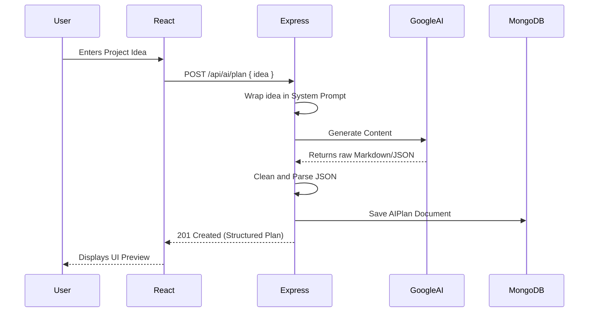

# High-Level Design (HLD)
**Project Name:** AI Project Mentor

## 1. System Architecture Overview
The AI Project Mentor application follows a standard Client-Server architecture utilizing the MERN stack, enhanced with a dual-database pattern (Polyglot Persistence) and external LLM integration.

```mermaid
graph TD
    Client[React Frontend (Vite)]
    API[Express.js Node Backend]
    Mongo[(MongoDB)]
    Postgres[(PostgreSQL)]
    LLM[Google Generative AI]

    Client <-->|REST API / JSON| API
    API <-->|Mongoose ODM| Mongo
    API <-->|pg Node Driver| Postgres
    API <-->|Google AI SDK| LLM
```

## 2. Technology Stack
- **Frontend:** React 19, React Router DOM, Axios.
- **Backend:** Node.js, Express.js.
- **Relational DB:** PostgreSQL (Handles structured, predictable identity and audit data).
- **Document DB:** MongoDB (Handles flexible, deeply nested project data and AI conversation histories).
- **AI Integration:** Google Generative AI (`gemini-1.5-flash`).

## 3. Polyglot Database Strategy
Why two databases?
1. **PostgreSQL** is utilized for the **Identity & Access Management (IAM)** layer. Users, roles, and project memberships are highly relational and require strict ACID compliance and constraints (Foreign Keys).
2. **MongoDB** is utilized for the **Application State** layer. Software projects, tasks, nested subtasks, and unpredictable AI conversation histories benefit heavily from a document-based NoSQL structure.

## 4. Backend Layered Architecture
The Node.js backend strictly follows a layered architectural pattern to separate concerns:

1. **Routing Layer (`/routes`)**: Maps HTTP verbs and URL paths to specific controllers.
2. **Middleware Layer (`/middleware`)**: Intercepts requests for Authentication (JWT checking) and Payload Validation before they hit business logic.
3. **Controller Layer (`/controllers`)**: Handles HTTP Request/Response cycle, parses parameters, and formats standard JSON responses (`success`, `data`, `message`).
4. **Service Layer (`/services`)**: Contains the core business logic. Coordinates with databases (Mongoose or pg) or external APIs (LLMs). Completely decoupled from Express.js objects.

## 5. Security & Authentication Flow
- **Stateless Auth:** Uses JSON Web Tokens (JWT).
- **Storage:** Tokens are stored in the client's `localStorage` and sent via the `Authorization: Bearer <token>` header on every protected request.
- **Secrets Management:** The `JWT_SECRET`, database URIs, and `LLM_API_KEY` are isolated in a `.env` file on the server and are never exposed to the React client.

## 6. AI Subsystem Flow

