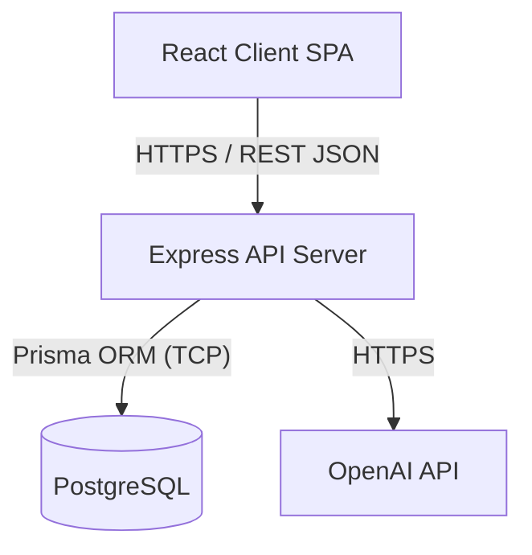

# High-Level Design (HLD)

## 1. Architecture Overview
The **AI Project Mentor** utilizes a modern, decoupled client-server architecture. The frontend is a React-based SPA that communicates with a Node.js/Express backend API. The backend interfaces with a PostgreSQL database via Prisma ORM for structured data, and external AI services (OpenAI) for intelligent processing.

---

## 2. System Components

### 2.1 Client Application (Frontend)
- **Framework:** React + Vite
- **Styling:** Tailwind CSS + shadcn/ui (Metallic Theme)
- **Animations:** Framer Motion & React Three Fiber (3D Elements)
- **Routing:** React Router v7
- **Responsibility:** Handles user interactions, visual rendering, local state management, and API consumption.

### 2.2 API Server (Backend)
- **Framework:** Node.js + Express
- **Architecture Pattern:** MVC-inspired (Controllers, Services, Routes, Models/Prisma Schema).
- **Authentication:** JWT (JSON Web Tokens) with custom middleware.
- **Responsibility:** Business logic execution, authentication, database transactions, and proxying requests to external AI APIs.

### 2.3 Database Tier
- **Primary Database:** PostgreSQL
- **ORM:** Prisma Client
- **Responsibility:** Stores Users, Projects, Memberships, and Activity Logs. Ensures data integrity and relational mapping.

### 2.4 External Services
- **AI Engine:** OpenAI API (GPT-4/GPT-3.5)
- **Responsibility:** Natural language processing, generating project plans, and providing chat-based mentorship.

---

## 3. Component Diagram

---

## 4. Data Flow
### 4.1 User Authentication Flow
1. User submits credentials to `/api/auth/login`.
2. Express Server validates credentials against PostgreSQL via Prisma.
3. Upon success, Server signs a JWT and returns it to the Client.
4. Client stores JWT (e.g., in memory/localStorage) and attaches it to subsequent `Authorization` headers.

### 4.2 AI Project Generation Flow
1. User prompts the AI via the Client Dashboard.
2. Client sends prompt to `/api/ai/generate`.
3. Server receives request, validates user via JWT middleware.
4. Server constructs a comprehensive system prompt and sends it to the OpenAI API.
5. OpenAI returns a structured JSON response (Project Plan, Tasks).
6. Server parses the response, uses Prisma to create a new `Project` and associated `Tasks` in PostgreSQL.
7. Server returns the newly created Project Object to the Client.
8. Client updates UI state and navigates user to the Project Details view.
