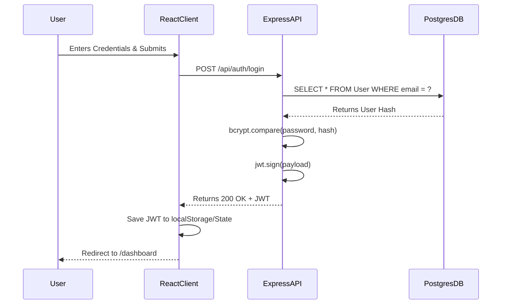

# Low-Level Design (LLD)

## 1. Database Schema (Prisma / PostgreSQL)

### 1.1 `User` Model
Stores authentication and profile data.
- `id`: Int (Primary Key, Auto-increment)
- `name`: String (VarChar 100)
- `email`: String (Unique, VarChar 255)
- `password_hash`: String (VarChar 255)
- `role`: String (Default: "STUDENT")
- `created_at` / `updated_at`: DateTime

### 1.2 `Project` Model
Represents a software project.
- `id`: Int (Primary Key, Auto-increment)
- `project_uuid`: String (Unique, UUID)
- `title`: String
- `owner_id`: Int (Foreign Key -> User.id)
- `created_at`: DateTime

### 1.3 `ProjectMember` Model
Junction table for collaborative workspaces.
- `id`: Int (Primary Key)
- `project_id`: Int (Foreign Key -> Project.id)
- `user_id`: Int (Foreign Key -> User.id)
- `role`: String (Default: "MEMBER")

### 1.4 `ActivityLog` Model
Audit trail for actions within the system.
- `id`: Int (Primary Key)
- `user_id`: Int? (Foreign Key -> User.id)
- `project_id`: Int? (Foreign Key -> Project.id)
- `action`: String
- `entity_type`: String
- `metadata`: Json

---

## 2. API Contracts

### 2.1 Authentication Module (`/api/auth`)
#### `POST /api/auth/login`
- **Request Body:** `{ email, password }`
- **Response:** `{ token, user: { id, name, email } }`
- **Logic:** Find user by email, compare bcrypt hash, sign JWT.

#### `POST /api/auth/register`
- **Request Body:** `{ name, email, password }`
- **Response:** `{ message: "User registered successfully" }`
- **Logic:** Hash password, insert into `User` table.

### 2.2 Project Module (`/api/projects`)
#### `GET /api/projects`
- **Headers:** `Authorization: Bearer <token>`
- **Response:** `[ { id, title, status, progress, ... } ]`
- **Logic:** Fetch all projects where `owner_id` equals JWT `userId` or user exists in `ProjectMember`.

#### `DELETE /api/projects/:id`
- **Headers:** `Authorization: Bearer <token>`
- **Response:** `204 No Content`
- **Logic:** Verify ownership, execute Prisma `delete` on `Project`. Cascade deletes associated members and logs.

---

## 3. Client Architecture (React)

### 3.1 Folder Structure
```
client/src/
├── components/
│   └── ui/           # Reusable Shadcn components (Button, Card)
├── hooks/            # Custom React hooks (useAuth, useProjects)
├── pages/            # View components (Landing, Dashboard, Login)
├── routes/           # AppRoutes.jsx (React Router config)
└── lib/              # Utilities (Tailwind cn merge)
```

### 3.2 State Management
- **Global State:** Managed via Context API or Custom Hooks (`useAuth` for user session, `useProjects` for caching project lists).
- **Local State:** `useState` for form handling (Login, Register).

### 3.3 UI Component Rules (Metallic Theme)
- `Button`: Must utilize `.metallic-btn` utility class. Backgrounds are strictly dark (`#1A1A1A`), borders are subtle (`#555`), and hovers implement linear-gradient shines.
- `Card`: Utilizes glassmorphism (`backdrop-blur-xl`, `bg-[#111]/80`) with soft inner shadows to represent physical metallic plates.

---

## 4. Sequence Diagrams

### 4.1 Login Sequence

